# Azure AI/ML Landing Zone Pattern Module - Architecture Diagram

## Overall Landing Zone Architecture

## Deployment ComponentBreakdown

## Networking Architecture

## AI Services Architecture

## Deployment Phases

```mermaid
graph LR
    Start["🚀 Start Deployment"]

    P1["Phase 1<br/>Networking<br/>- VNet<br/>- Subnets<br/>- NSGs"]

    P2["Phase 2<br/>Gateway Layer<br/>- App Gateway<br/>- WAF Policy<br/>- Firewall"]

    P3["Phase 3<br/>AI Platform<br/>- AI Hub<br/>- AI Projects<br/>- Agent Service"]

    P4["Phase 4<br/>Data Services<br/>- AI Search<br/>- Cosmos DB<br/>- Storage"]

    P5["Phase 5<br/>Compute<br/>- Container Apps<br/>- VMs<br/>- Bastion"]

    P6["Phase 6<br/>Integration<br/>- API Management<br/>- Container Registry<br/>- Connections"]

    P7["Phase 7<br/>Monitoring<br/>- Log Analytics<br/>- Diagnostics<br/>- Alerts"]

    End["✅ Deployment Complete"]

    Start --> P1
    P1 --> P2
    P2 --> P3
    P3 --> P4
    P4 --> P5
    P5 --> P6
    P6 --> P7
    P7 --> End

    style P1 fill:#8BA882,color:#fff
    style P2 fill:#C9A4A4,color:#fff
    style P3 fill:#8BA5C7,color:#fff
    style P4 fill:#D9B0B3,color:#000
    style P5 fill:#D4B896,color:#000
    style P6 fill:#A68BB8,color:#fff
    style P7 fill:#C9A678,color:#000
```

##Configuration Scenarios

### Scenario 1: StandaloneAI Foundry Only

### Scenario 2: Enterprise Full Stack

## Key Design Decisions

| Component | Standard Pattern | Enterprise Pattern |
|-----------|------------------|-------------------|
| **Network** | Simple VNet | VNet w/ Multiple Subnets + Firewall |
| **Ingress** | App Gateway | App Gateway + WAF + API Management |
| **AI Foundry** | Project-only | Hub + Multiple Projects + Agents |
| **Data** | Storage Account | Cosmos DB + AI Search + BING |
| **Access** | Public Endpoints | Private Endpoints + Bastion |
| **Security** | Network ACLs | Full Zero-Trust with CMK |
| **Monitoring** | Log Analytics | LAW + Diagnostics + Alerts |
| **Compute** | VMs Optional | Container Apps + VMs + Bastion |

## Related Modules

- **terraform-azurerm-avm-ptn-aiml-ai-foundry**: AI Foundry account and project management
- **Example Deployments**:
  - `default/` - Standard LZ setup
  - `default-byo-vnet/` - Bring your own VNet
  - `standalone/` - Single dedicated deployment
  - `standalone-byo-vnet/` - Standalone with external network

## Documentation References

- [Azure AI Foundry Documentation](https://learn.microsoft.com/azure/ai-studio/)
- [AI/ML Landing Zone Accelerator](https://learn.microsoft.com/en-us/azure/cloud-adoption-framework/)
- [Azure Well-Architected Framework](https://learn.microsoft.com/azure/well-architected/)
