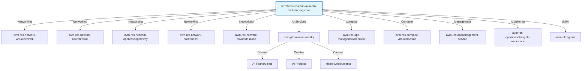

# Code References and Usage Diagram

```mermaid
graph TD
    Root[terraform-azurerm-avm-ptn-aiml-landing-zone] -->|Networking| VNet[avm-res-network-virtualnetwork]
    Root -->|Networking| Firewall[avm-res-network-azurefirewall]
    Root -->|Networking| AppGw[avm-res-network-applicationgateway]
    Root -->|Networking| Bastion[avm-res-network-bastionhost]
    Root -->|Networking| PDNS[avm-res-network-privatednszone]

    Root -->|AI Services| Foundry[avm-ptn-aiml-ai-foundry]
    Foundry -->|Creates| Hub[AI Foundry Hub]
    Foundry -->|Creates| Project[AI Projects]
    Foundry -->|Creates| Models[Model Deployments]

    Root -->|Compute| CAE[avm-res-app-managedenvironment]
    Root -->|Compute| JumpVM[avm-res-compute-virtualmachine]

    Root -->|Management| APIM[avm-res-apimanagement-service]
    Root -->|Monitoring| LAW[avm-res-operationalinsights-workspace]

    Root -->|Utility| Regions[avm-utl-regions]

    classDef module fill:#e1f5fe,stroke:#01579b,stroke-width:2px;
    class Root module;
```
